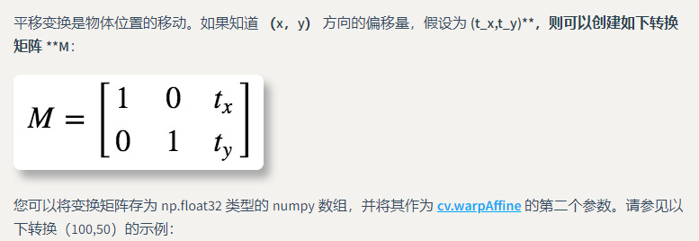

## 第八章总结

> 图像的几何变换并不会改变图像的像素

### 图像的位置变换

1. 第一个例子——图像平移
    1. 
    2. 课本中并没有对这个函数的各个参数进行解读
    3. 图片资料来源 https://opencv.apachecn.org/#/docs/4.0.0/4.2-tutorial_py_geometric_transformations
2. 第二个例子——图像旋转
    1. 书中的例子缩放因子为 **1.2** 但是它却说原图大小
    2. 关于 `getRotationMatrix2D` 函数的使用
    3. 第一个是旋转中心，第二个是旋转角度，第三个是旋转后的缩放因子
    4. 关于 `warpAffine` 函数中 M 参数
    5. M 参数是一个变换矩阵
        1. 2x3的变换矩阵 （线代）
3. 第三个例子——不裁剪的旋转
    1. / 和 // 的区别: // 对计算的结果取整
4.

### 图像的形状变换